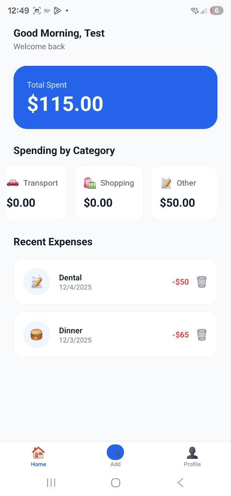
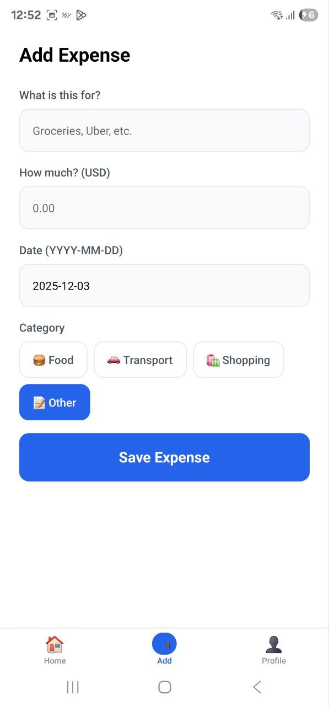

💰 Expensify - Smart Expense Tracker

Student Name: Maeesh Asif
Student ID: S1600179
Module: Mobile Applications Development

A modern expense tracking application built with React Native, Expo, and NativeWind.

✨ Key Features

📝 Smart Logging: Add expenses with Title, Amount, Category, and Date.

📅 Backdating: Manually input past dates; list sorts automatically.

📊 Visual Categories: Expenses are automatically tagged with icons (🍔, 🚗, 🛍️).

💾 Data Persistence: User data and expenses are saved permanently on the device.

🔐 Authentication: Simulated login flow (accepts any email address).

📸 Screenshots & Technical Breakdown

Authentication Flow

Main Dashboard




Secure Entry Point


Demonstrates the app's initial state, guarding user data behind a simulated login. It features a clean, responsive form managed via the global Context API.

Dynamic Visualization


The core hub. Automatically calculates total spending using array reduction. The "Spending by Category" section aggregates data in real-time.

Smart Data Entry

Profile & Persistence




Backdating & Logic


Features a Backdating Input (YYYY-MM-DD) allowing users to log past expenses. The app logic automatically re-sorts the list chronologically.

Session Management


Displays persistent user details retrieved from AsyncStorage. Includes 'Sign Out' and 'Reset All Data' for full data control.

📂 Project Structure

The project follows a scalable src architecture to ensure clean code separation:

```text
src/
├── app/                 # Expo Router Screens (Navigation)
│   ├── (app)/          # Protected Routes (Dashboard, Add, Profile)
│   ├── login.tsx       # Public Login Screen
│   └── _layout.tsx     # Root Stack Layout configuration
├── lib/
│   ├── auth/           # Context API Logic (Global State)
│   └── storage.tsx     # AsyncStorage Utilities (Persistence)
├── components/         # Reusable UI Components
└── nativewind-env.d.ts # TypeScript definitions for styling
```

🚀 How to Run

Clone the repo:

git clone [https://github.com/maeesh-asiff1787/expense-tracker-assignment.git](https://github.com/maeesh-asiff1787/expense-tracker-assignment.git)
cd expense-tracker-assignment


Install dependencies:

npm install


Start the app:

npx expo start -c


Test: Scan the QR code with the Expo Go app on your phone.

🛠️ Tech Stack

Framework: React Native (Expo Router)

Styling: NativeWind (Tailwind CSS)

State: React Context API

Storage: AsyncStorage
